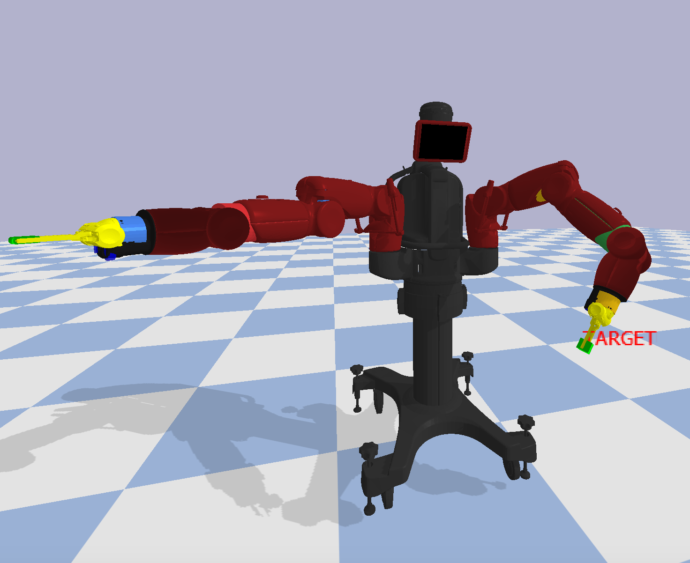
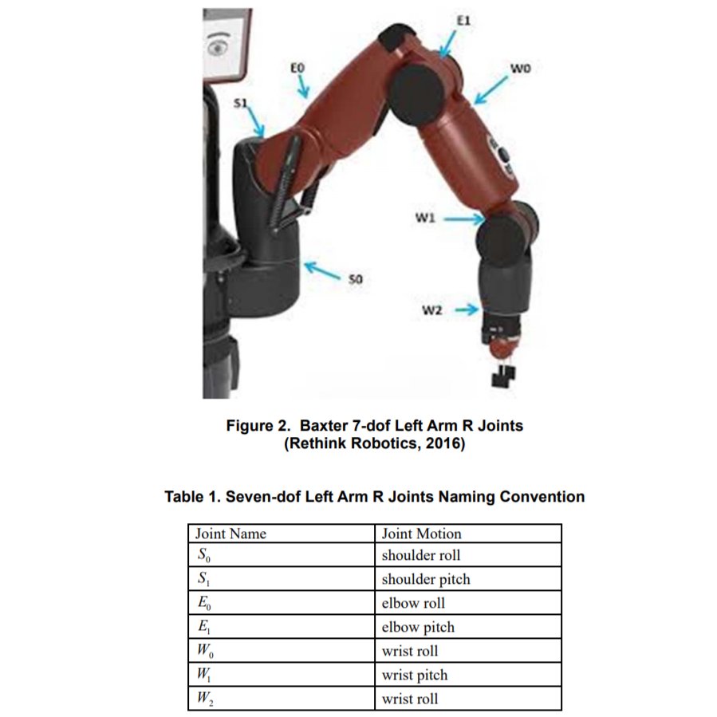
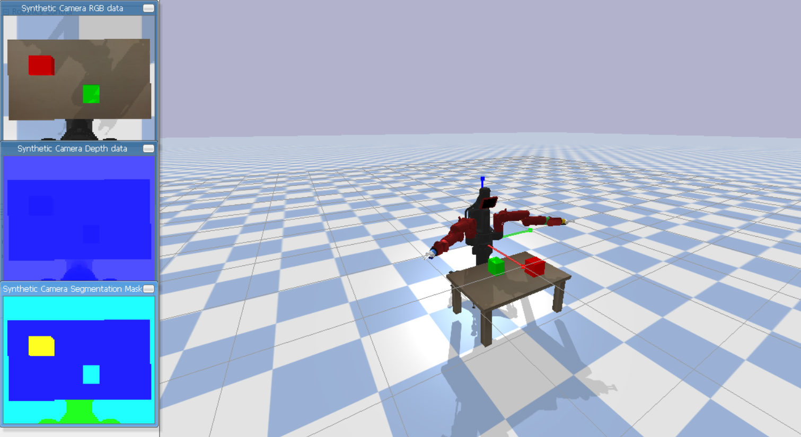
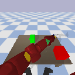
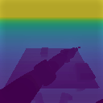
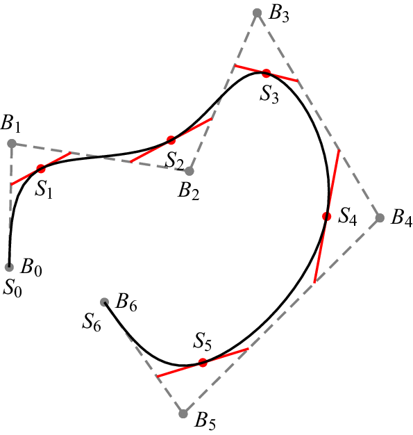

<h3>Table of Contents</h3>
<ul>
    <li><a href="#introduction">Introduction</a></li>
    <li><a href="#overview">Overview</a></li>
    <li><a href="#implementation">Implementation</a></li>
    <li><a href="#installation-and-setup">Installation and Setup</a></li>
    <li><a href="#usage">Usage</a></li>
    <li><a href="#future-work">Future Work</a></li>
    <li><a href="#team">Team</a></li>
</ul>

<h3 id="introduction">Introduction</h3>
<div>
   In the rapidly evolving field of robotics, one of the major challenges is enabling robots to efficiently manage multiple tasks simultaneously, a concept we refer to as Simultaneous Work. While humans are adept at using both hands to perform different actions concurrently, robots have yet to achieve comparable proficiency. This project aims to address this gap by leveraging Reinforcement Learning algorithms, exploring their potential to not only match but possibly exceed human capabilities in simultaneous task management. Through this approach, we seek to advance the autonomy of robotic systems, opening new possibilities for their application in real-world environments.
</div>

<h3 id="overview">Overview</h3>
<div>
   To facilitate this exploration, we leverage <b>Baxter</b>, humanoid robot as our agent. <a href="https://www.ohio.edu/mechanical-faculty/williams/html/pdf/BaxterKinematics.pdf">Baxter</a> is equipped with two highly versatile arms, making it an ideal candidate for studying dual-arm coordination and manipulation tasks. By using state-of-the-art algorithms, we aim to enable Baxter to perform complex, simultaneous operations.<br><br>

   <table align="center">
   <tr align="center">
      <td>
         
      </td>
      <td>
         
      </td>
   </tr>
   </table>
   <br>
   The realised environment is fully compatible with the OpenAI Gym framework, allowing for seamless integration with existing RL libraries and tools. The simulation is powered by PyBullet, a robust and widely-used physics engine that provides realistic and accurate modeling of robotic interactions.
   <br>
   <br><br>
</div>

<h3 id="implementation">Implementation</h3>
<div>
   <h4>Project Milestones</h4>
   <ul>
      <li>Creating the environmental setup</li>
      <li>Defining a comprehensive <strong>Joint Reward</strong> function</li>
      <li>Learning simple simultaneous tasks</li>
      <li>Elevating interaction levels</li>
   </ul>

   <p>
      We have developed the environment aimed at facilitating fundamental tasks such as simultaneous lifting, touching, and other coordinated actions. At present, The focus is on formulating the <strong>Markov Decision Process (MDP)</strong>.
   </p>

   <p>
      By focusing on these elements, we aim to create a robust framework that will enable the agent to learn and perform simultaneous tasks with increasing complexity. This approach will help in understanding how reinforcement learning algorithms can be utilized to achieve and potentially surpass human-like proficiency in coordinated tasks.
   </p>

   <ol>
      <li>
         <strong>Markov Decision Process (MDP) Formulation</strong>:
         <br><br>
         <div align="center">
            
         </div>
         <br><br>
         <ul>
            <li>
               <strong>Transition Model</strong>: Establishing the probabilities of transitioning from one state to another given a specific action, which is crucial for predicting the outcomes of the agent's actions.
            </li>
            <li>
               <strong>State Space</strong>: Defining the set of all possible states the agent can be in, considering factors such as the position of its arms, the objects in the environment, and the agent's current task status.
            </li>
            <li>
               <strong>Action Space</strong>: Specifying the set of all possible actions the agent can take in each state, including movements of the arms, grasping, and releasing objects.
            </li>
         </ul>
      </li>
      <br>
      <li>
         <strong>Joint Reward Function</strong>:
         <ul>
            <li>
               <strong>Reward Components</strong>: Creating a reward structure that incentivizes successful completion of tasks, efficient use of both arms, and adherence to predefined task constraints and objectives.
            </li>
            <li>
               <strong>Optimization</strong>: Ensuring that the reward function balances immediate rewards for task completion and long-term rewards for developing efficient and effective strategies.
            </li>
         </ul>
      </li>
   </ol>
</div>

<h3 id="installation-and-setup">Installation and Setup</h3>
<blockquote>
   It is recommended to set up a virtual environment to avoid conflicts between package versions installed on your system and keep your workspace organized. To create a virtual environment and activate it, please follow the instructions detailed on <a href="https://docs.python.org/3/library/venv.html">python venv page</a>. The procedure to deactivate the environment is also provided here.
</blockquote>
<br>
<ul>
   <li>Clone the git repo using <code>git clone https://github.com/asood-life/baxter-sma.git</code></li>
   <li>Install the required packages using <code>pip install -e baxter-env</code></li>
</ul>

<h3 id="usage">Usage</h3>
<div>
   Upon installing and setting up the environment, import it into your workspace using the following python code
</div>
<br>

``` python
import baxter_env
import gym

env = gym.make('baxter_env-v0')
```

<p>
   Once you have imported the environment, you gain access to various functions tailored for different tasks. Here are some of the essential functions along with their descriptions:
</p>

<ul>
   <li>
      <code>env.getImage()</code>: returns a tuple containing <b>128x128 RGB</b> image along with depth map of environment.
   </li>
   <br>
   <p align="center">
      
      
      <p align="center"><b>Image Data with Depth Map</b></p>
   </p>
   <li><code>env.moveVC()</code>: moves the joints to a specified position by taking the index of that joint.</li>
   <li><code>env.step()</code>: input a list of actions and perform those while providing the required information about the states.</li>
   <li><code>env.render()</code>: renders the eye view image of the environment.</li>
   <li><code>env.reset()</code>: reset the entire environment and retrieve information regarding the state.</li>
</ul>

<p>In addition to these core functions, we have also implemented some auxiliary functions for specific purposes:</p>

<ul>
   <li><code>env.BezierCurve()</code>: An implementation of a family of curves that provides a trajectory passing through points.</li>
   <li><code>env.getReward()</code>: returns the reward for attempting simultaneous touching (a naive method).</li>
</ul>

<br>
<div align="center">
   
</div>
<br><br>

<p>
   For further details on theze functions and their arguments, please refer to the documentation <a href="baxter-env/baxter_env/envs/baxter_env.py">here</a>.
</p>
<p>Example scripts demonstrating the usage of these functions can be found <a href="examples/">here</a>.</p>

<h3 id="future-work">Future Work</h3>
<div>
   <h4>1. Enhanced Learning Algorithms</h4>
   <p>
      While our current implementation leverages existing reinforcement learning algorithms, there is a vast landscape of emerging techniques that could be explored. Future work could focus on integrating more advanced methods such as deep reinforcement learning, hierarchical reinforcement learning, or multi-agent reinforcement learning.
   </p>
   <h4>2. Real-World Integration</h4>
   <p>
      Transitioning from simulated environments to real-world applications poses a significant challenge. Future efforts will aim at testing and refining our models in real-world settings to address issues such as sensor noise, unexpected obstacles, and dynamic changes in the environment. This will involve robust testing and possibly redesigning the reward structures and action spaces to better suit real-world conditions.
   </p>
   <h4>3. Expanded Task Set</h4>
   <p>
      Currently, our tasks are relatively simple and focused on basic interactions. Expanding the range of tasks to include more complex and varied activities such as assembly, cooking, or even medical procedures could provide deeper insights into the capabilities and limitations of reinforcement learning in robotic applications.
   </p>
   <h4>4. Human-Robot Collaboration</h4>
   <p>
      Another exciting avenue for future work is the exploration of human-robot collaboration. Enabling robots to understand and predict human actions, and to coordinate tasks in a shared workspace, could greatly enhance the adoption of robotic systems in industries such as manufacturing, healthcare and domestic environments.
   </p>
   <h4>5. Hardware Integration</h4>
   <p>
      As new robotic hardware becomes available, integrating these advancements into our system will be crucial. This includes more dexterous robotic arms, better sensory equipment, and improved computational capabilities. Future work will involve adapting our software to take full advantage of these hardware improvements.
   </p>
</div>

<h3 id="team">Team</h3>
<div>
    <table>
      <td align="center">
         <a href="https://github.com/monako2001">
            
            <br />
            <sub>
               <b>Mainak Samanta</b>
            </sub>
         </a>
         <br />
      </td>
      <td align="center">
         <a href="https://github.com/asood-life">
            
            <br />
            <sub>
               <b>Akshat Sood</b>
            </sub>
         </a>
         <br />
      </td>
      <td align="center">
         <a href="https://github.com/Amshra267">
            
            <br />
            <sub>
               <b>Aman Mishra</b>
            </sub>
         </a>
         <br />
      </td>
      <td align="center">
         <a href="https://github.com/arch-raven">
            
            <br />
            <sub>
               <b>Aditya Kumar</b>
            </sub>
         </a>
         <br />
      </td>
   </table>
</div>

<hr>
<div>
    Thank you for taking the time to go through this project! If you find it valuable, please consider giving it a ⭐ star. Your support is appreciated and helps others in discovering the project. Should you have any enhancement requests or encounter a bug, please report it in the <a href="https://github.com/asood-life/baxter-sma/issues">Issues</a> section. Your feedback is crucial in improving this project for all.
</div>
